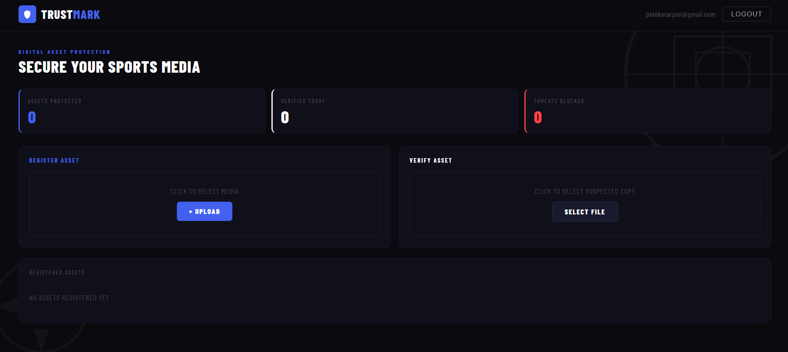

# TrustMark — Digital Sports Media Protection

AI-powered invisible watermarking system to protect and authenticate official sports media content.

## What it does
- Upload sports media and embed an invisible ownership watermark
- Verify any suspected unauthorized copy instantly
- All assets stored securely in Firebase Firestore

## Tech Stack
- React (Frontend)
- Firebase Auth + Firestore
- Python FastAPI (Backend)

## Backend Repo
https://github.com/Arpan-Patekar/trustmark-backend

## Setup
1. Clone the repo
2. Run `npm install`
3. Add your Firebase config to `src/firebase.js`
4. Run `npm start`

## Built for
Google Solution Challenge 2026 — Digital Asset Protection Track
